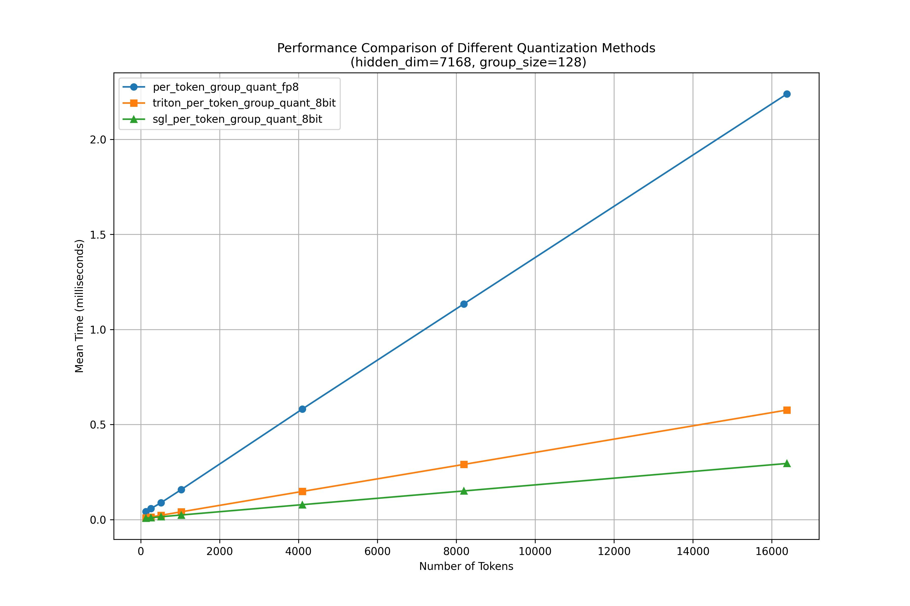

# 🚀 面向大语言模型的高级量化工具包

这是一个高性能、可扩展的大语言模型（LLM）量化框架，支持 **AWQ**、**SmoothQuant** 和 **FP8** 量化，并提供灵活的量化粒度选项。  
- [English Version (英文版)](quant/README_EN.md)
---

## ✨ 功能概览

| 功能 | 状态 |
|------|------|
| **量化方法** | |
| • AWQ（Activation-aware Weight Quantization） | ✅ 已支持 |
| • SmoothQuant | ✅ 已支持 |
| • FP8 量化（E4M3 / E5M2 格式） | ✅ 已支持 |
| **量化粒度** | |
| • Per-tensor（整个张量统一缩放） | ✅ 已支持 |
| • Per-channel（权重按输出通道缩放） | ✅ 已支持 |
| • Per-group（按固定分组缩放，如 group size=128） | ✅ 已支持 |
| • Per-token（激活值按 token 动态缩放） | ✅ 已支持 |
| • Per-token-group（激活值按单个token的group_size大小） | ✅ 已支持 |
| **FP8 能力** | |
| • 静态 FP8 量化 | ✅ 已支持 |
| • 动态 FP8 量化 | ✅ 已支持 |
| • 多卡 FP8 量化 | ✅ 已支持 |
| **高性能 Kernel（开发中）** | |
| • Triton: `per_token_group_quant` | ✅ 已支持 |
| • Triton: `w8a8_block_fp8_matmul` | ✅ 已支持 |
| • CUTE: `per_token_group_quant_8bit` | 🟨 开发中 |
| • CUTE: `fp8_gemm_cute` | 🟨 开发中 |
| • CUDA: `per_token_group_quant_8bit`（手写优化） | ✅ 已支持 |

---
## Benchmark
使用`test/test_per_token_group_quant.py`测试不同shape下，fp8 per_group_quant的性能，如下图所示。
在长输入的情况下， cuda手写的kernel相较于triton kernel会有30%左右的性能收益。



## 🚀 快速开始

### 安装依赖
```bash
# 安装量化包及依赖
pip uninstall datasets modelscope -y
pip install addict zstandard
pip install "modelscope[dataset]" --upgrade
pip install -e .
```

### 运行示例（AWQ）
请提前准备好模型文件。
```bash
cd quant/examples
python awq_quantize.py
```

---

## 🧩 扩展框架

### 添加新模型
1. 编辑 `quant/core/api.py`  
   在 `Quant_CAUSAL_LM_MODEL_MAP` 中注册你的模型：
   ```python
   Quant_CAUSAL_LM_MODEL_MAP = {
       "llama": LlamaQuantizer,
       "qwen": QwenQuantizer,
       "your_model": YourModelQuantizer,  # ← 在此处添加
   }
   ```

### 添加新量化方法
1. 在 `quant/quantization/__init__.py` 中注册方法：
   ```python
   method_to_quantizer = {
       "awq": AWQQuantizer,
       "smoothquant": SmoothQuantQuantizer,
       "your_method": YourMethodQuantizer,  # ← 在此处添加
   }
   ```
2. 在 `quant/quantization/your_method/` 目录下创建：
   - `__init__.py`
   - `quantizer.py`（实现量化逻辑）
3. 在 `quant/nn_models/modules/linear/linear_*.py` 中，  
   将 FP16 的 Linear 层替换为你的量化 Linear 层。

---

## 🔗 相关项目

- [**AWQ: 面向 LLM 压缩与加速的激活感知权重量化**](https://github.com/mit-han-lab/llm-awq)  
- [**SmoothQuant: 高精度高效的 LLM 后训练量化**](https://github.com/mit-han-lab/smoothquant)  
- [**NVIDIA FP8 Transformer Engine**](https://docs.nvidia.com/deeplearning/transformer-engine/user-guide/)
- [**SGLang**](https://github.com/sgl-project/sglang/tree/main/python)

---

## 📄 许可证

本项目采用 **Apache License 2.0** 开源协议。详情请见 [LICENSE](LICENSE)。

---

> 💡 **欢迎贡献！**  
> 我们鼓励社区贡献新的量化方法、模型支持以及高性能计算 Kernel。
